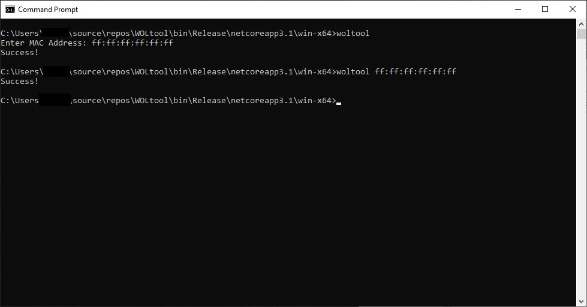

# WOLtool
.NET Core Wake-On-Lan console utility.

** Be sure you have .NET Core 3.1 or newer runtime installed - https://dotnet.microsoft.com/download **

Instructions:

1) Make sure the remote computer has Wake-On-Lan enabled in the System BIOS, and the remote network adapter supports WOL and has it enabled.

2) Startup WOLtool, provide MAC Address of the remote computer's network card.
  optional: You can also run the program from the command line: WOLtool.exe <MACAddress>
  
3) If Magic Packet broadcast is successful, you will receive a "Success!" message. As long as the remote computer is properly configured, it should wake.

NOTE: To run on a macOS/Linux system you will need to run this from terminal/bash. Be sure you set the file permissions for WOLtool to be executable via terminal:
```
chmod 755 WOLtool
sudo ./woltool
```


